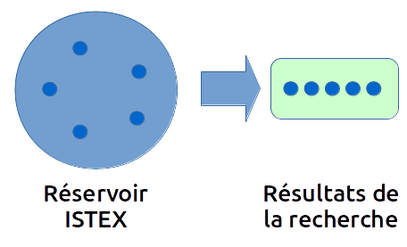
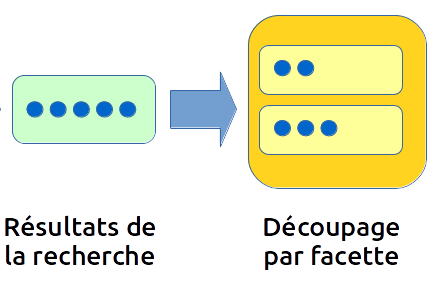
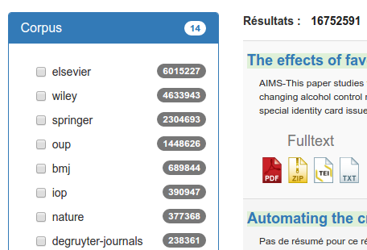

# un exemple est toujours plus parlant

Reprenons le schéma ci-dessus. Nous souhaitons connaître \*\*tous les documents de la base ISTEX comprenant le mot "einstein"\*\*. Nous avons donc effectué une requête \[?q=einstein\]\(http://api.istex.fr/document/?q=einstein\), ce qui correspond à la première partie du schéma :

Ici, la recherche ne nous a retourné que \*\*5 résultats\*\*, représentés par les points bleus \(il s'agit évidemment d'un exemple\). Nous souhaitons maintenant, en plus, connaître \*\*quels sont les corpus concernés, et combien de documents sont affectés à ces corpus\*\*. Il existe alors plusieurs solutions :

  \* Nous pouvons, par exemple, effectuer plusieurs requêtes en ajoutant à la recherche précédente les noms des corpus, par exemple \[?q=einstein AND corpusName:elsevier\]\(http://api.istex.fr/document/?q=einstein AND corpusName:elsevier\), puis \[?q=einstein AND corpusName:wiley\]\(http://api.istex.fr/document/?q=einstein AND corpusName:wiley\), etc. Non seulement faire cet ensemble de requête est fastidieux, mais le risque d'oublier un corpus est important. 

  \* Nous pouvons également utiliser l'option \[&output=corpusName\]\(http://api.istex.fr/document/?q=einstein&output=corpusName\) pour afficher le champ concerné, et compter manuellement le nombre de fois où chaque nom de corpus apparait. Dans notre exemple, avec 5 résultats, cela peut sembler simple, mais la majorité des requêtes propose un nombre de résultats bien plus important.

La meilleure solution consiste alors à utiliser une facette \[&facet=corpusName\]\(http://api.istex.fr/document/?q=einstein&facet=corpusName\). Cette dernière va, en plus du résultat de la requête, ajouter \*\*un objet "aggregations"\*\* à la fin du JSON généré. Cet objet montre le découpage des 5 résultats trouvés par leur nom de corpus : 

Ici, nous n'avons que \*\*deux noms de corpus\*\* \(par exemple, elsevier et wiley\), le premier contenant 2 des résultats et le second les 3 autres.

Les facettes sont donc très utiles pour filtrer sur une collection de données. Elles permettent, comme ici, de \*\*générer des états de collection\*\*, mais également à montrer à l'utilisateur final des moyens d'\*\*affiner leur recherche\*\*. En effet, l'objet "aggregations" peut être mappé sur votre portail :

