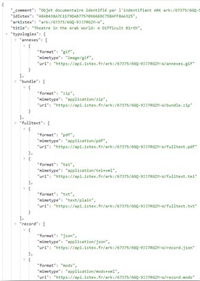

# Mais pourquoi mettre un ARK ?

**=&gt; Actuellement lorsque vous recherchez le PDF d'un article**

_« Theatre in the Arab World: A Difficult Birth »_ l'URL se construit ainsi

[https://api-istex-fr/document/48AB438A7C1179DAB7757096669C75BAFF8AA325/fulltext/pdf?auth=ip,fede&sid=ebsco,istex-view](https://api-istex-fr/document/48AB438A7C1179DAB7757096669C75BAFF8AA325/fulltext/pdf?auth=ip,fede&sid=ebsco,istex-view)

[https://api.istex.fr/document/48AB438A7C1179DAB7757096669C75BAFF8AA325/fulltext/pdf?sid=istex-browser-addon?](https://api.istex.fr/document/48AB438A7C1179DAB7757096669C75BAFF8AA325/fulltext/pdf?sid=istex-browser-addon?)

* URL de la plateforme
* Document/ numéro ISTEX/
* Format du document
* Les modes [d’authentification](https://api.istex.fr/documentation/access/) avec en premier l’adresse IP puis la fédération d’identité
* Le sid qui caractérise la voie d’accès

| 1er exemple | [EDS/EBSCO Istex view](https://doc.istex.fr/users/discovery/) |
| --- | --- |
| 2ème exemple | [L’extension](https://addons.istex.fr/) |

**=&gt; Dorénavant toutes les notices ont également un identifiant pérenne ARK \(Archival Resource Key\)**

Sachant que les 2 types d’accès au document perdureront.

_« Theatre in the Arab World: A Difficult Birth »_ qui provient de “Cambridge” l’accès au document se fait maintenant, également, avec cette url :

[https://api.istex.fr/ark:/67375/6GQ-9JJ7RGZM-W/fulltext.pdf](https://api.istex.fr/ark:/67375/6GQ-9JJ7RGZM-W/fulltext.pdf)

**=&gt; L’intérêt, aujourd’hui, c’est de pointer directement sur un format grâce au qualificatif**

[https://api.istex.fr/ark:/67375/6GQ-9JJ7RGZM-W/](https://api.istex.fr/ark:/67375/6GQ-9JJ7RGZM-W/)

La racine sans qualificatif indique toutes les typologies qui existent pour ce document

**Le qualificatif** permet l’accès à un format spécifique.

[**https://api.istex.fr/ark:/67375/6GQ-9JJ7RGZM-W/fulltext.tei**](https://api.istex.fr/ark:/67375/6GQ-9JJ7RGZM-W/fulltext.tei)

**=&gt; Et demain, les qualificatifs permettront de pointer, citer… une page…une image …** Pour en savoir plus sur les ARK n’hésitez pas à consulter [le billet de blog](http://blog.istex.fr/des-ark-dans-istex/) et [la documentation sur les ARK](https://api.istex.fr/documentation/ark/)

