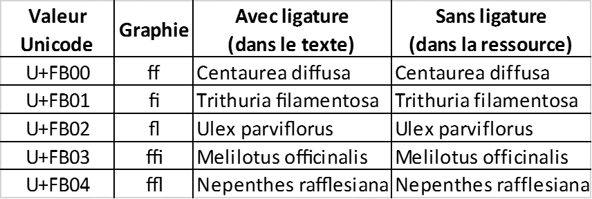

# Détecter les ligatures dans le TXT

En typographie, on appelle ligature la fusion de plusieurs caractères. Une ligature peut être linguistique, donc obligatoire, comme **æ** ou **œ** dans des mots comme « c**æ**cum » ou « b**œ**uf ». Elle peut aussi être esthétique, donc optionnelle, pour améliorer la lisibilité d'un document imprimé. C'est notamment le cas des documents PDF. Le problème, c'est qu'un mot avec une ligature ou son équivalent sans ligature ne sont pas considérés comme identiques, aussi bien lors du requêtage que lors des différents traitements réalisés sur le corpus obtenu.

Par exemple, la recherche de noms d'espèces végétales à partir d'une ressource terminologique \(taxonomie\) sera incomplète si on ne remplace pas les ligatures par les chaînes de caractères correspondantes. Le tableau suivant montre les différentes ligatures concernées avec des exemples pris dans le texte et dans la ressource \([The Plant List](http://www.theplantlist.org/)\). La différence est parfois subtile à nos yeux, mais elle est rédhibitoire pour un programme.

Pour ne pas gêner la reconnaissance de mots dans le texte, on recherche les ligatures afin de les remplacer par la forme sans ligature.

Le script Perl [**ligature.pl**](https://git.istex.fr/scodex/harvest-corpus/blob/master/outils/ligature/ligature.pl) a été développé afin de faire cette correction dans un fichier ou un répertoire de fichiers. Il est téléchargeable dans Gitbucket.

