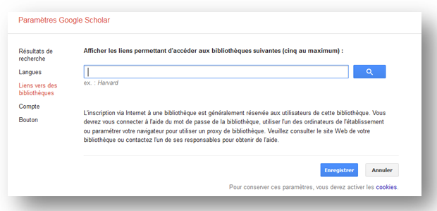
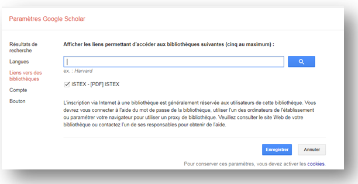

# Bouton ISTEX

L’ajout d’une extension ISTEX dans un navigateur, Chrome ou Firefox, a comme vocation d’analyser l'ensemble des pages visitées à la recherche d'identifiants documentaires \(DOI, PII, PMID...\) et d’ajouter un bouton « ISTEX » d’accès au plein-texte PDF lorsque celui est disponible dans l’API ISTEX.

Le bouton « ISTEX » peut s’activer notamment sur les pages Wikipédia, Google Scholar, Scopus, ou même HAL augmentant ainsi la visibilité et la diffusion des ressources ISTEX.

Comme pour tous les autres modes d’accès au PDF \([widgets](https://widgets.istex.fr), [démonstrateur](http://demo.istex.fr)…\) il est limité aux ayants droit ISTEX, c'est-à-dire les personnels de l'Enseignement Supérieur et de la Recherche.

Cette extension fait un usage intensif du [**service de résolution OpenURL de l’API ISTEX**](https://api.istex.fr/documentation/openurl/).

L'extension ISTEX est disponible pour les navigateurs web Firefox et Chrome ici : [**https://addons.istex.fr**](https://addons.istex.fr/). Vous trouverez ci-dessous comment l'installer étape par étape pour les différents navigateurs web.

## Firefox

=&gt; La recherche sur Wikipédia d’[**« Hélium »**](https://fr.wikipedia.org/wiki/Hélium) donne la bibliographie suivante :

=&gt; Aller sur [**https://addons.istex.fr**](https://addons.istex.fr/)

=&gt; Cliquer sur « Ajouter l’extension à Firefox »

=&gt; Autoriser l’installation

_Retrouver l’extension dans « Ouvrir le menu/Modules/Extensions »_

=&gt; Un écran propose alors la possibilité d’avoir un lien vers la bibliothèque ISTEX sur Google Scholar en cliquant sur «Oui» sans avoir besoin de l’installer

=&gt; En cliquant «Passer » pas de lien vers la bibliothèque ISTEX

=&gt; Recharger la page de Wikipédia « Ctrl F5 »

## Chrome

=&gt; La recherche sur Wikipédia d’[**« Hélium »**](https://fr.wikipedia.org/wiki/Hélium) donne la bibliographie suivante :

=&gt; Aller sur [**https://addons.istex.fr**](https://addons.istex.fr/)

=&gt; Cliquer sur « Ajouter l’extension à Chrome »

=&gt; Autoriser l’installation

_Retrouver l’extension dans « Personnaliser et contrôler Google Chrome/Plus d'outils/Extensions »_

=&gt; Un écran propose alors la possibilité d’avoir un lien vers la bibliothèque ISTEX sur Google Scholar en cliquant sur «Oui» sans avoir besoin de l’installer

=&gt; En cliquant «Passer » pas de lien vers la bibliothèque ISTEX

=&gt; Recharger la page de Wikipédia « Ctrl F5 »

